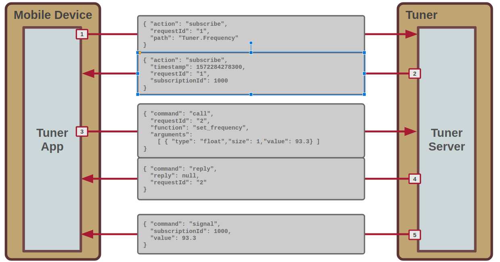
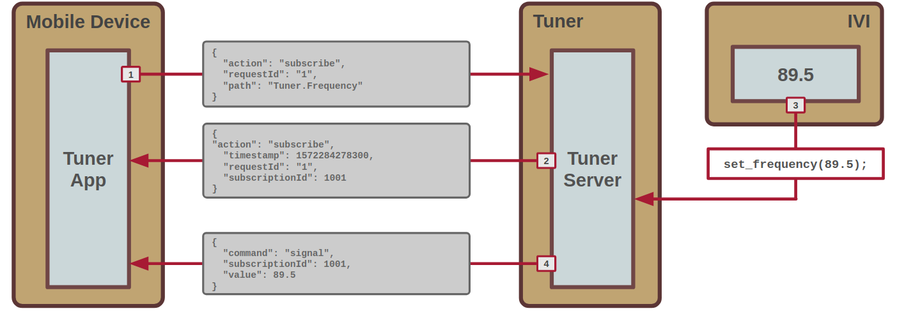

# VISS-RPC

This document describes an extension to the W3C automotive group's
[W3C Vehicle Information Service
(VISS)](https://www.w3.org/TR/vehicle-information-service) that
supports Remote Procedure Calls (RPC).

It intends to be backward compatible with the existing VISS
specification.

A stripped-down reference implementation is provided to enable
protocol explorations by trial.

# RPC CALL DESCRIPTION

A VISS client can invoke a function on VISS server via a RPC call,
transmitted as JSON over the same websocket as the VISS signal
protocol.

An RPC call will always generate a JSON reply, sent back from server
to client, containing information if the function was successfully
invoked or not. A return value can also optionally be included.

Below is sequence diagram combining signal subscriptions, RPC calls,
and signal deliveries into a single call flow.

*Fig. 1 - Standard call flow*

The steps executed are as follows.

#### 1,2 - Signal Subscription

Signal subscribption will bfe done through the `subscribeRequest` and
`subscribeSuccessResponse` schemas specified in the
[VISS Spec](https://www.w3.org/TR/vehicle-information-service/#dfn-subscriberequest)

#### 3 - Remote Function Call Request

The JSON payload of a VISS RPC call has the following elements:

| Element     | Type        | Value      | Description                                                                                  |
|-------------|-------------|------------|----------------------------------------------------------------------------------------------|
| `action`    | string      | `"call"`   | Specifies that this is a remote function call request                                        |
| `requestId` | string      | sender-set | A sender-assigned transaction ID that will be sent back with the function call request reply |
| `function`  | string      | sender-set | The function that we want to execute                                                         |
| `arguments` | object list | sender-set | A list of arguments to supply with the function                                              |

Each JSON object in the `argument` list has the following elements

**NOTE: Do we need to support nested structs?**

| Element | Type      | Value      | Description                                                                           |
|---------|-----------|------------|---------------------------------------------------------------------------------------|
| `type`  | string    | `"int8"`   | Specifies a signed 8 bit integer argument                                             |
|         |           | `"uint8"`  | Specifies an unsigned 8 bit integer argument                                          |
|         |           | `"int16"`  | Specifies a signed 16 bit integer argument                                            |
|         |           | `"uint16"` | Specifies an unsigned 16 bit integer argument                                         |
|         |           | `"int32"`  | Specifies a signed 32 bit integer argument                                            |
|         |           | `"uint32"` | Specifies an unsigned 32 bit integer argument                                         |
|         |           | `"bool"`   | Specifies a boolean argument                                                          |
|         |           | `"float"`  | Specifies an floating point argument                                                  |
|         |           | `"double"` | Specifies is an double (floating point) argument                                      |
|         |           | `"string"` | Specifies dynamic length string argument                                              |
| `size`  | integer   | sender-set | The number of values provided in the `value` element array.                           |
| `value` | See below | sender-set | A list of values to be forwarded as a single (array) argument to the remote function. |

The `value` element varies its format depending on the `type` and `size` elements:

| Type   | Size | Format      | Min             | Max            | Example                   | Description                       |
|--------|------|-------------|-----------------|----------------|---------------------------|-----------------------------------|
| int8   | 1    | string      | `"-128"`        | `"-127"`       | `"-42"`                   | Signed 8 bit integerinteger       |
| int8   | >1   | string list | `"-128"`        | `"-127"`       | `["-42", "42"]`           | Array of signed 8 bit integers    |
| uint8  | 1    | string      | `"0"`           | `"255"`        | `"237"`                   | Unsigned 8 bit integer            |
| uint8  | >1   | string list | `"0"`           | `"255"`        | `["-42", "42"]`           | Array of unsigned 8 bit integers  |
| int16  | 1    | string      | `"-32768"`      | `"32767"`      | `"-4711"`                 | Signed 16 bit integerinteger      |
| int16  | >1   | string list | `"-32768"`      | `"32767"`      | `["-4711","4711"]`        | Array of signed 16 bit integers   |
| uint16 | 1    | string      | `"0"`           | `"65535"`      | `"47111"`                 | Unsigned 16 bit integer           |
| uint16 | >1   | string list | `"0"`           | `"65535"`      | `[ "1", "47111"]`         | Array of unsigned 16 bit integers |
| int32  | 1    | string      | `"-2147483648"` | `"2147483647"` | `"-1234567"`              | Signed 32 bit integerinteger      |
| int32  | >1   | string list | `"-2147483648"` | `"2147483647"` | `["-1234567", "1234567"]` | Array of signed 32 bit integers   |
| uint32 | 1    | string      | `"0"`           | `"4294967295"` | `"32101234567"`           | Unsigned 32 bit integer           |
| uint32 | >1   | string list | `"0"`           | `"4294967295"` | `["0", "32101234567"]`    | Array of unsigned 32 bit integers |
| bool   | 1    | string      | `"0"`           | `"1"`          | `"1"`                     | Boolean                           |
| bool   | >1   | string list | `"0"`           | `"1"`          | `["0", "1"]`              | Array of boolean                  |
| float  | 1    | string      | N/A             | N/A            | `"123.321"`               | 32 bit floating point             |
| float  | >1   | string list | N/A             | N/A            | `["-123.123", "123.123"]` | Array of 32 floating points       |
| double | 1    | string      | N/A             | N/A            | `"-321.321"`              | 64 bit floating point             |
| double | >1   | string list | N/A             | N/A            | `["-321.321", "321.321"]` | Array of 64 floating points       |

#### 4 - Remote Function Call Reply

The server responds to the remote function call message with a reply
indicating if the remote function was invoked or not.

| Element     | Type   | Value      | Description                                                                |
|-------------|--------|------------|----------------------------------------------------------------------------|
| `action`    | string | `"reply"`  | Specifices that this is a reply message                                    |
| `requestId` | string | sender-set | Set to the same value as provided with the original `"call"` message       |
| `reply`     | object | See below  | Reply payload sent back by the invoked function. None if error or no reply |
| `error`     | object | See below  | **Only provided if function invocation fails** Error description            |

The `reply` object is an JSON object with the same format as `arguments` in a RPC call.

The `error` object has the string members `number`, `reason`, and `message` as specified
in the [VISS Spec](https://www.w3.org/TR/vehicle-information-service/#errors).

If the call is successful, no `error` element is provided with the server reply.

The following combinations can be returned in `code`, `reason`, and `message`

| `number` | `reason`              | `message`                                                                    |
|----------|-----------------------|--------------------------------------------------------------------------------|
| `"503"`  | `"unknown_function"`  | The function specified in the call request `function` element is not available |
| `"400"`  | `"missing_argument"`  | One or more elements in the function request request table were not provided   |
| `"400"`  | `"unknown_type"`      | One or more arguments in the `arguments` object list were if an unknown type   |
| `"406"`  | `"protocol_mismatch"` | The VISS server does not support the protocol version.                          |

#### 5 - Signal Delivery

Signal delivery will be done through the `subscriptionNotification` schema specified
in the [VISS Spec](https://www.w3.org/TR/vehicle-information-service/#dfn-subscriptionnotification).

# Subscribing to signals outside function calls
Signals can be subscribed to outside the use case of remote function
calls as specified by the current specification, as shown in fig 3.

*Fig. 3 - External signal delivery*

The call flow for signal subscription and delivery is idenical to that
of the remote function call. The only difference is the VISS server may
deliver a signal to the VISS client on its own in iniative, for example
due to an external event suc as the volume dial being turned by the
driver.

# REFERENCE IMPLEMENTATION INSTALLATION

## 1.1 - Install prerequisite packets

    sudo apt install python3-websockets # python3-distutils python3-dev python3-setuptools

## 1.2 - Clone the VISS

    git clone XXX

## 1.3 - Start `viss-rpc_server.`

    cd viss-rpc
    ./viss-rpc-server.py

## 1.4 - Run a simple RPC call

    ./viss-rpc-client.py
